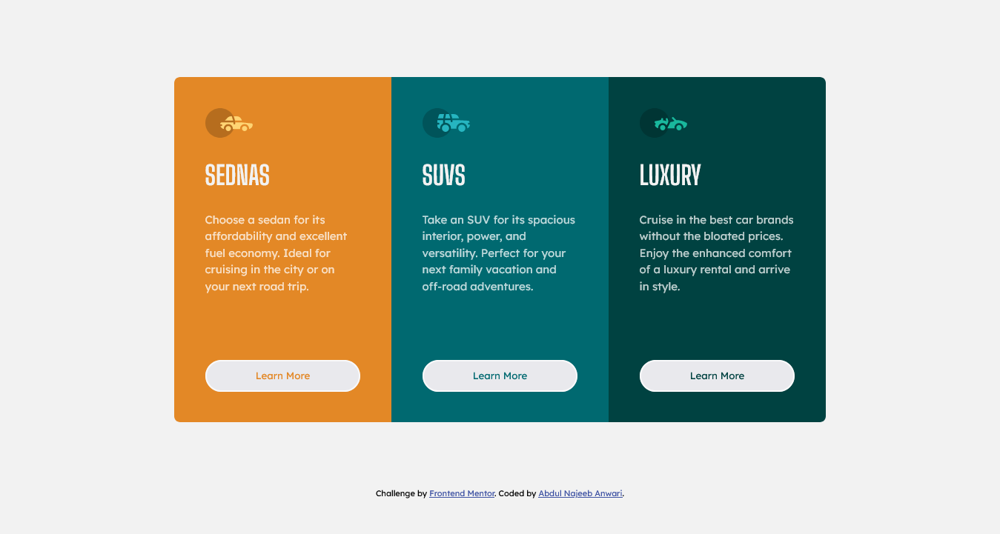

# Frontend Mentor - 3-column preview card component solution

This is a solution to the [3-column preview card component challenge on Frontend Mentor](https://www.frontendmentor.io/challenges/3column-preview-card-component-pH92eAR2-). Frontend Mentor challenges help you improve your coding skills by building realistic projects. 

## Table of contents

- [Overview](#overview)
  - [The challenge](#the-challenge)
  - [Screenshot](#screenshot)
  - [Links](#links)
- [My process](#my-process)
  - [Built with](#built-with)
  - [Useful resources](#useful-resources)
- [Author](#author)

## Overview

### The challenge

Users should be able to:

- View the optimal layout depending on their device's screen size
- See hover states for interactive elements

### Screenshot

### Links

- Solution URL: [Solution](https://github.com/najeeb-anwari/3-column-preview-card-component-using-grid)
- Live Site URL: [Live View](https://najeeb-anwari.github.io/3-column-preview-card-component-using-grid/)

## My process

### Built with

- Semantic HTML5 markup
- CSS custom properties
- CSS Grid
- Mobile-first workflow

### Useful resources

- [Wesbos CSS Grid Course](https://www.youtube.com/playlist?list=PLu8EoSxDXHP5CIFvt9-ze3IngcdAc2xKG) - This is a nice course to learn about CSS Grid.

## Author

- Frontend Mentor - [@najeeb-anwari](https://www.frontendmentor.io/profile/najeeb-anwari)
- Github - [@najeeb-anwari](https://github.com/najeeb-anwari)
- Linkedin - [@nabdul-najeeb-anwari](https://www.linkedin.com/in/abdul-najeeb-anwari/)

